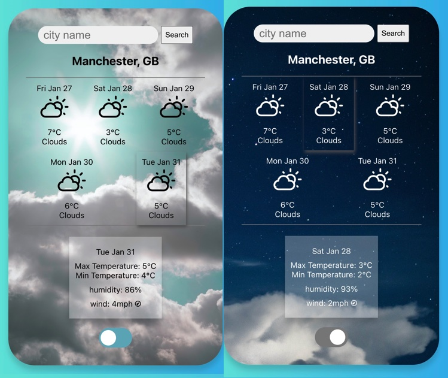
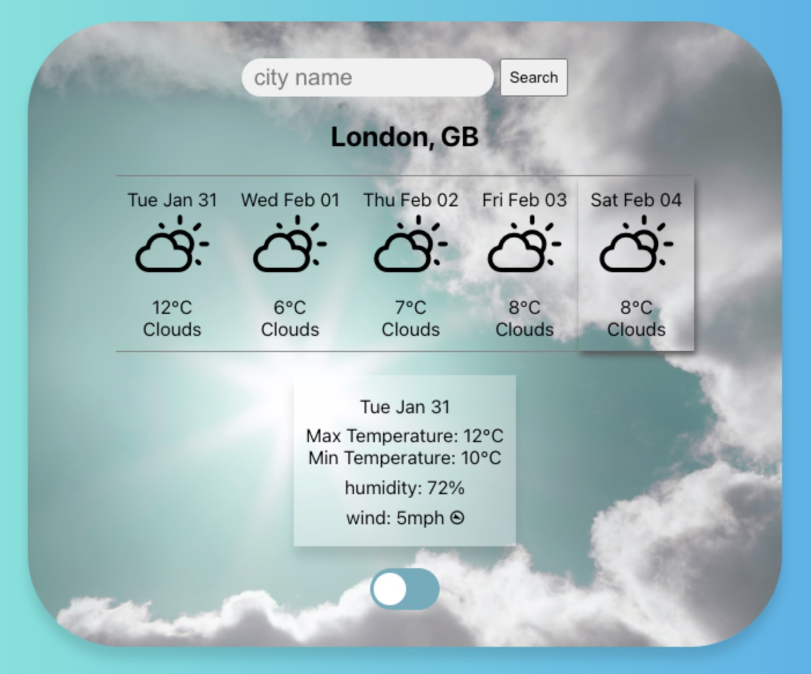

# Weather App

A weather app created by using React and tested using React Testing Library.

## Table of contents

- [Introduction](#introduction)
- [Concepts covered](#concepts-covered)
- [Setup & getting started](#setup-&-getting-started)
- [Using the app](#using-the-app)
- [Author](#author)

## Introduction

This is my first frontend project created by bootstratpping with [Create React App](https://github.com/facebook/create-react-app) with testing carried out using React Testing Library. The app shows the 5 days of forecast summaries for a UK city with more details of a particular day's forecast being displayed. The app also is displayed in a light or dart theme mode. 




## Concepts covered

- React, a JavaScript library, to build user interfaces (UI) and web applications
- Incorporating HTML in React using JSX (JavaScript XML)
- Props to pass data between React components
- State to allow components to create and manage their own data
- React Hooks that 'hook' onto React state and lifecycle features to isolate the reusable part from a functional component
- Comparison between React Hooks and classes
- React Testing Library (RTL) to test UI 
- Rendering components with virtual DOM for abstracting away manual DOM manipulations during testing
- Event handling
- Making a HTTP request to an API using axios package in JavaScript and processing the response
- Error handling using axios

## Setup & getting started
- Create a fork of this repo and clone the fork. 
- Change directory into the cloned folder and install project dependencies. This app requires React, Axios and dev dependencies RTL.
- To test the app, run ``` npm test```.
- To start the app, run ``` npm start```. This starts the app at http://localhost:3000. 

## Using the app
Start by typing the name of a UK city in the search box and click 'search'. This will render the summaries of 5 day weather forecasts for that city. Hoover over and press any of the forecast to get more detailed forecasts including max and min temperatures, humidity and wind speed and direction. If the searched city is not found or wrong name is input, an error message is displayed. Use the toggle button to switch between light and dark mode. 

## Future work
If I have more time, I would like to add these:
- Making the app responsive to many different devices
- Improving UI for the detailed forecast of a specific day and theme toggle button
- Adding functionality of showing a UK map with the city location marked

------------------

## Author

👤 **HJ Kang** 
- GitHub [@cocomarine](https://github.com/cocomarine) 
- LinkedIn [@hj-kang07](https://www.linkedin.com/in/hj-kang07/) 